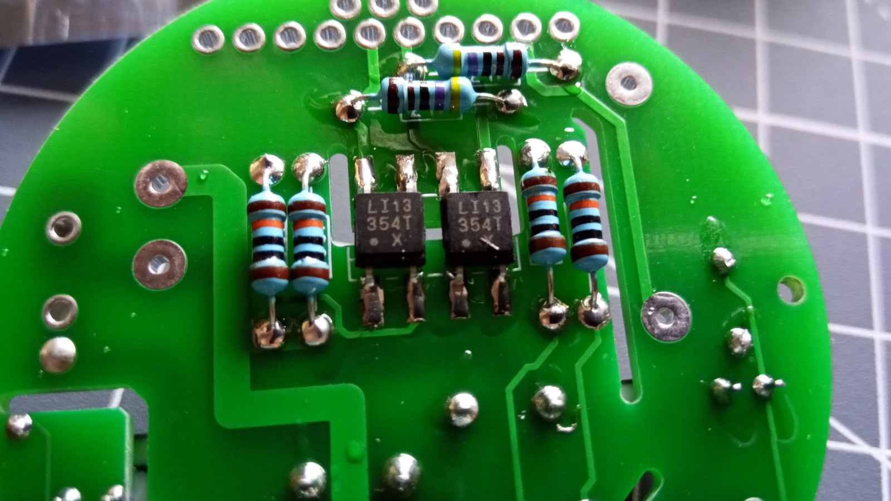

# HM-LC-Sw2-FM
# 2x 6A 230V Schaltkontakt mit 2 Schalteingängen 230V; 

## benötigte Hardware
* 1x Arduino Pro Mini **ATmega328P (3.3V/8MHz)**
* 1x CC1101 Funkmodul **(868 MHz)**
* 1x FTDI Adapter (wird nur zum Flashen benötigt)
* 1x Klemme AST 06 3,5 (AST 06 3,5)
* 2x pa1a-5v
* 2x BC546
* 3x 1/4W 330 Ohm Widerstand
* 1x Led 5mm
* 1x Taster 6x6
* 2x Diode 1N4148
* 1x HI-Link HLK-PM01
* 2x Buchsenleiste, gerade, RM 2,54 (BL 1X10G 2,54) Anzahl der Pins Anpassen!
* 2x Stiftleiste RM 2,54 16 St.
* 1x SMD-Sicherung 4A (UMT 4,0A)
* 4x 1/4W 100 kOhm Widerstand Wird nur benötigt wenn 230V Tastereingänge benutzt werden!
* 2x 1/4W 4,7 kOhm Widerstand
* 2x Optokoppler LTV 354T-SMD (LTV 354T-SMD) Wird nur benötigt wenn 230V Tastereingänge benutzt werden!

[Kontakt via Facebook](https://www.facebook.com/ronny.thomas.83)

[Software je nach Projekt](https://github.com/jp112sdl/Beispiel_AskSinPP/blob/master/examples/HM-LC-Sw2-FM/HM-LC-Sw2-FM.ino)

Reset Taster Auslöten

Tastereingänge Low Voltage! wenn diese Variante benutzt wird sind die zwei Optokoppler und die 4 100K Widerstände nicht nötig!

